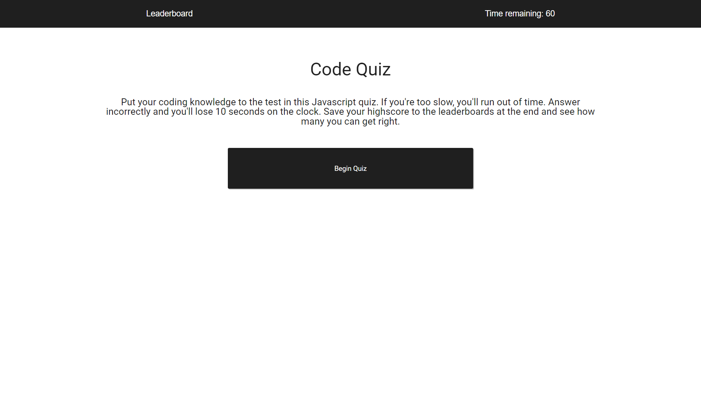
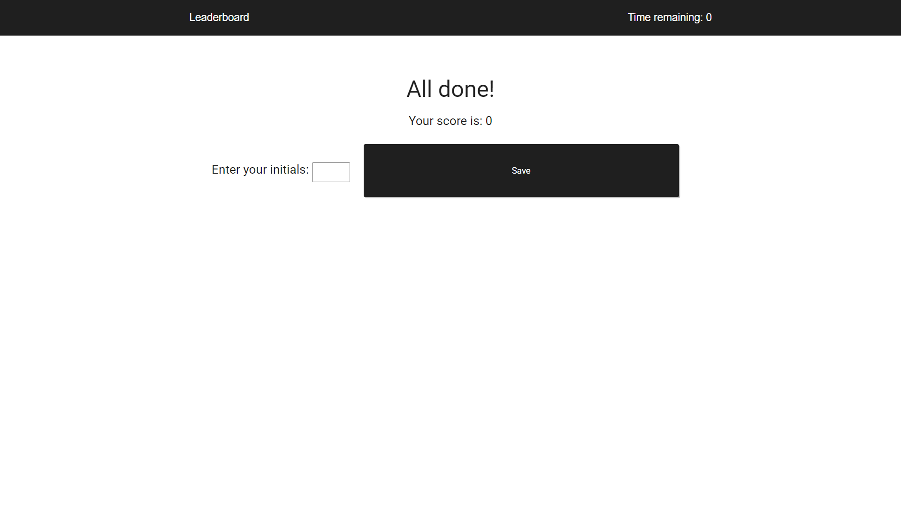
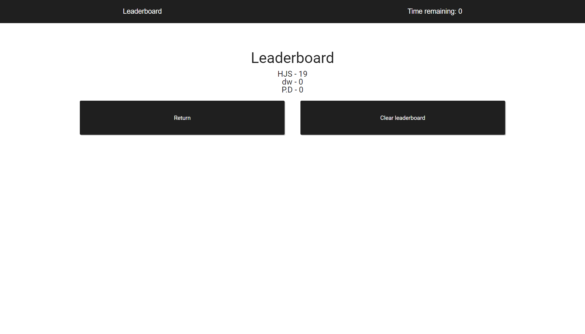

# 📔 Code-Quiz

A website made using HTML, CSS & JS with the purpose of testing the users basic JavaScript knowledge.

# Features:

- Initial landing page with brief description of the quiz.
- Link to a leaderboard page displaying saved scores from local storage.
- 6 questions to complete by clicking on potential answer buttons.
- 60 second timer to complete the quiz in, taking 15 seconds off per incorrect answer.
- Input initials and save score when finished quiz.

# 📑 [Deployed Website](https://wratten.github.io/Code-Quiz/)

